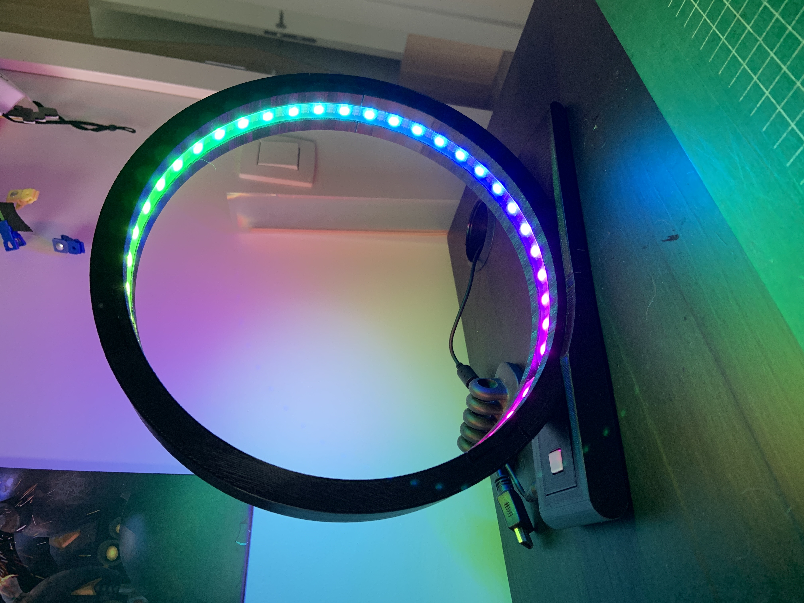

# Circular Desk Lamp

What started as "I'm going to fix my desk lamp" ended up in "Screw it, I'm going to make my own lamp". I've designed a circular lamp with an RGB strip inside to provide sufficient light in my desk, plus some extra fancy effects. Enjoy!

## Part list:

- Adadruit Trinket M0 [link](https://shop.pimoroni.com/products/adafruit-trinket-m0-for-use-with-circuitpython-arduino-ide)
- WS2812 led strip [link](https://shop.pimoroni.com/products/flexible-rgbw-led-strip-neopixel-ws2812-sk6812-compatible?variant=30260032733267)
- Buttons [link](https://shop.pimoroni.com/products/maker-essentials-switches-potentiometers)
- DC Barrel Power jack [link](https://shop.pimoroni.com/products/dc-barrel-power-jack-connector)
- Rocker Switch [link](https://shop.pimoroni.com/products/rocker-switch)
- Adapter [link](https://www.amazon.nl/gp/product/B08DYBQN3J/ref=ppx_yo_dt_b_asin_title_o01_s00?ie=UTF8&psc=1)

## Prints:

Every part was printed with a Prusa Mini+ and Prusament Jet Black PLA. All parts were printed with 15% infill, except for the base which was 30% infill. 

## Assembly:

I have no detailed guide, but everything explains itself quite easily. All core components are hidden in the base and soldered together there. It's kind of messy, so feel free to create a real board for this purpose.